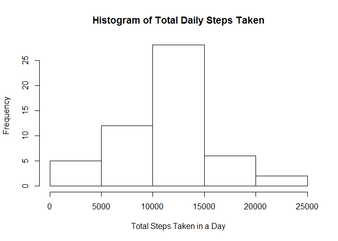
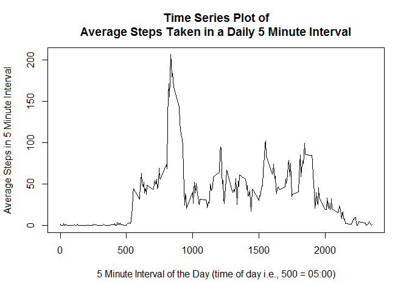
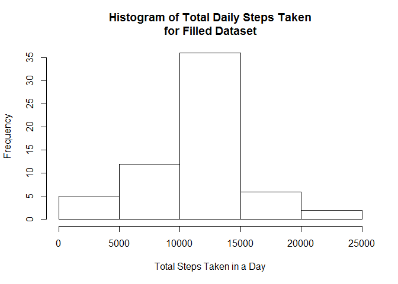
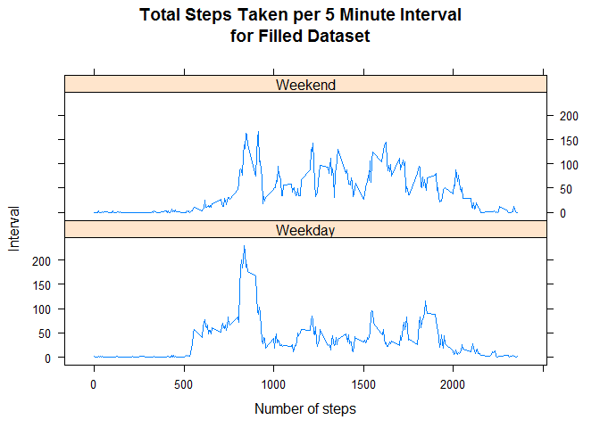

# Reproducible Research: Peer Assessment 1


## Loading and preprocessing the data

Read the one .csv file from the .zip source file directly, setting the column
classes and header names during the import.


```r
dat <- read.csv(
    unz("activity.zip", "activity.csv"),
    colClasses = c("numeric","Date","numeric"), header = TRUE
)
```

Show the data summary as a test:


```r
summary(dat)
```

```
##      steps             date               interval     
##  Min.   :  0.00   Min.   :2012-10-01   Min.   :   0.0  
##  1st Qu.:  0.00   1st Qu.:2012-10-16   1st Qu.: 588.8  
##  Median :  0.00   Median :2012-10-31   Median :1177.5  
##  Mean   : 37.38   Mean   :2012-10-31   Mean   :1177.5  
##  3rd Qu.: 12.00   3rd Qu.:2012-11-15   3rd Qu.:1766.2  
##  Max.   :806.00   Max.   :2012-11-30   Max.   :2355.0  
##  NA's   :2304
```


## What is mean total number of steps taken per day?

Summarize total steps by date into a new dataframe, making sure to remove
missing values from the aggregation.


```r
dailySteps <- aggregate(
    steps ~ date, dat = dat, FUN = "sum", na.action = na.omit
)
```


```r
hist(
    dailySteps$steps,
    main = "Histogram of Total Daily Steps Taken",
    xlab = "Total Steps Taken in a Day"
)
```

 

Calculate and report the mean and median.


```r
mn <- mean(dailySteps$steps)
md <- median(dailySteps$steps)
# "format(round(x, 1), nsmall = 1)" used inline in the report below:
```

The data shows **10766.2 mean** and **10765.0 median** total daily steps taken.


## What is the average daily activity pattern?

Make a time series plot of the 5-minute interval (x-axis) and the average number of steps taken, averaged across all days (y-axis).


```r
intervalSteps <- aggregate(
    steps ~ interval, dat = dat, FUN = "mean", na.action = na.omit 
)
```


```r
plot(
    intervalSteps$interval, intervalSteps$steps,
    main = "Time Series Plot of\nAverage Steps Taken in a Daily 5 Minute Interval",
    xlab = "5 Minute Interval of the Day (time of day i.e., 500 = 05:00)",
    ylab = "Average Steps in 5 Minute Interval",
    type = "l"
)
```

 

Which 5-minute interval, on average across all the days in the dataset, contains the maximum number of steps?


```r
mx <- intervalSteps$interval[ intervalSteps$steps == max(intervalSteps$steps) ]
# mx used inline in the report below:
```

The data shows **interval 835** has the maximum daily steps on average.


## Imputing missing values

Calculate and report the total number of missing values in the dataset (i.e. the total number of rows with NAs).


```r
missing <- is.na(dat$steps)
# sum(missing) used inline in the report below:
```

The dataset has **2304 missing** step values.

Devise a strategy for filling in all of the missing values in the dataset and create a new dataset that is equal to the original dataset but with the missing data filled in.

Make a copy of original.


```r
dat2 <- dat
```

Replace any NA row with the interval average for the NA interval as taken from the table we found above *intervalSteps*.


```r
dat2$steps[missing] <-
    intervalSteps$steps[
        match(dat2$interval[missing], intervalSteps$interval)
    ]
```

Make a histogram of the total number of steps taken each day...


```r
dailySteps2 <- aggregate(
    steps ~ date, dat = dat2, FUN = "sum", na.action = na.omit
)
```


```r
hist(
    dailySteps2$steps,
    main = "Histogram of Total Daily Steps Taken\nfor Filled Dataset",
    xlab = "Total Steps Taken in a Day"
)
```

 

...and calculate and report the mean and median total number of steps taken per day.


```r
mn2 <- mean(dailySteps2$steps)
md2 <- median(dailySteps2$steps)
# "format(round(x2, 1), nsmall = 1)" used inline in the report below:
```

The data shows **10766.2 mean** and **10766.2 median** total daily steps taken when the dataset is filled with interval averages.

Do these values differ from the estimates from the first part of the assignment? What is the impact of imputing missing data on the estimates of the total daily number of steps?

Dataset | Mean    | Median
--------|---------|--------
Original| 10766.2 | 10765.0
Filled  | 10766.2 | 10766.2

**Filling in the missing values had almost no effect. The biggest effect was with the second histogram, where filling in the missing data with interval average data made the histogram mean more pronounced. The frequency of the mean bin went from about 27 to about 35.**  

**Also, a side effect was the new median wound-up becoming the mean value
by chance. The median should always be an integer in this case because
we are counting steps. But, we filled in some values with averages that
were not integer.**


## Are there differences in activity patterns between weekdays and weekends?

Create a new factor variable in the dataset with two levels -- "weekday" and "weekend" indicating whether a given date is a weekday or weekend day.


```r
dat2$dayType <- factor(
    ifelse(
        weekdays(dat$date) == "Sunday" | weekdays(dat$date) == "Saturday",
        "Weekend", "Weekday"
    )
)
```

Make a panel plot containing a time series plot of the 5-minute interval (x-axis) and the average number of steps taken, averaged across all weekday days or weekend days (y-axis).


```r
library(lattice)
xyplot(
    steps ~ interval | dayType, 
    aggregate(steps ~ interval + dayType, dat2, mean),
    layout = c(1,2),
    type = 'l',
    main="Total Steps Taken per 5 Minute Interval\nfor Filled Dataset", 
    ylab="Interval", xlab="Number of steps"
)
```

 


